# Kafka Client

Uses [franz-go](https://github.com/twmb/franz-go) (`kgo`) for both producing and consuming. Chosen over sarama for synchronous offset commit with error handling.

## Configuration

| Setting | Value | Why |
|---|---|---|
| Library | `twmb/franz-go` | Synchronous `CommitRecords` returns error, unlike sarama's fire-and-forget |
| Partitions | 6 | 2 instances × 3 partitions each = 6 concurrent workers, with room to scale to 6 instances |
| Offset commit | Manual, after unmarshal | Commit after successful unmarshal to prevent duplicate JWTs while allowing redelivery on unmarshal crash |
| Partitioning | Round-robin (no key) | Jobs are independent, we want even distribution |
| Auto-offset-reset | `earliest` | On first start or expired offsets, process from beginning rather than skip |

---

## How the client works

### Producer

The producer sends job messages to the Kafka topic. The topic is configured at creation time. Messages are JSON-encoded and distributed across partitions using round-robin (no message key).

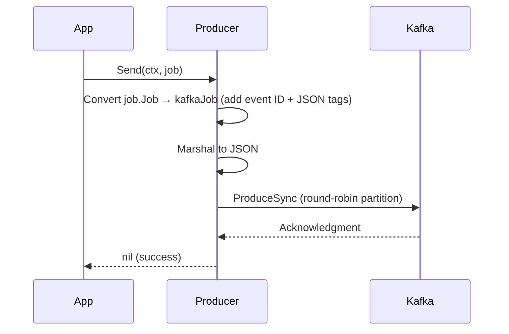

### Consumer

The consumer joins a consumer group. Kafka assigns partitions to it. `PollFetches` returns batches of records from all assigned partitions. Records are fanned out — one goroutine per partition processes records sequentially within that partition, while partitions are processed in parallel.

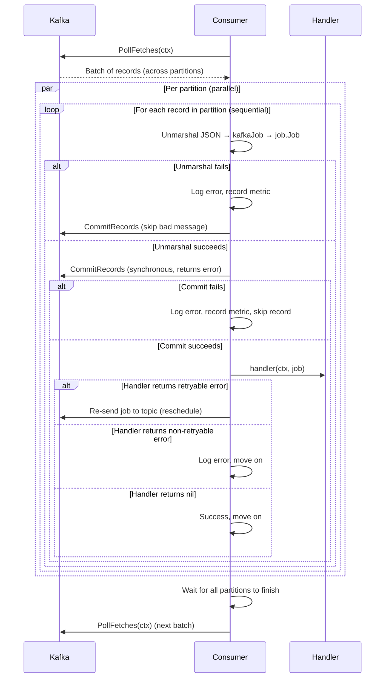

### Parallelism

Each call to `PollFetches` returns records from all assigned partitions. The consumer spawns one goroutine per partition and waits for all to finish before polling the next batch.

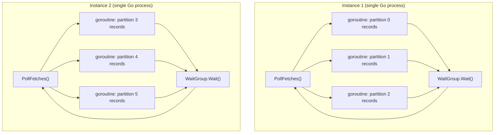

### Scaling behavior

1. **Instance 1 starts** — gets all 6 partitions, processes up to 6 in parallel
2. **Instance 2 starts** — triggers rebalance, each instance gets 3 partitions
3. **Instance 2 dies** — triggers rebalance, instance 1 gets all 6 back

Maximum useful consumers = number of partitions. Extra consumers sit idle as hot standbys.

---

## Commit strategy and failure points

We commit the offset **after unmarshal but before processing** the job. This is a deliberate design choice:

- **Unmarshal before commit:** If the instance crashes during unmarshal, the offset hasn't been committed, so the message will be redelivered. This is safe because unmarshal is a pure operation.
- **Commit before handler:** Once committed, the job won't be redelivered. This prevents duplicate JWTs since our job (generating a JWT and sending it to a webhook) is **not idempotent**.
- **Bad messages:** If unmarshal fails (corrupt data), we commit the offset anyway to avoid infinite redelivery loops. The error is logged and a metric is recorded.

With franz-go, `CommitRecords` is synchronous and returns an error. If the commit fails, we skip the record entirely — it will be redelivered on the next poll.

### Message processing flow

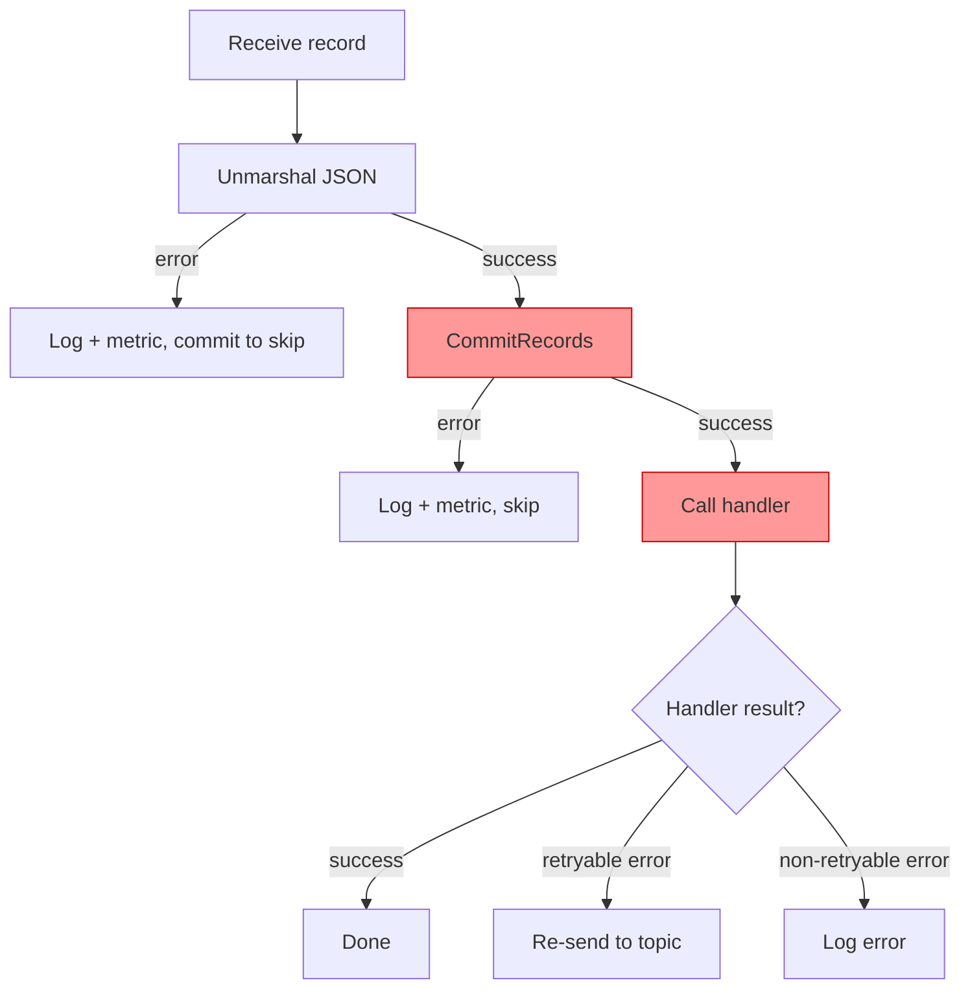

### Where jobs can be lost

> **The red-highlighted steps above are the danger zones.** A crash at these points means a committed offset with no processing.

| Failure point | What happens | Job lost? |
|---|---|---|
| Unmarshal fails (corrupt data) | Offset committed to skip bad message. Original job data was invalid. | N/A (not a valid job) |
| Crash during unmarshal | Offset not yet committed, message will be redelivered. | No |
| Commit fails | Record skipped, will be redelivered on next poll. | No |
| **After commit, before handler starts** | **Offset committed, handler never ran.** | **YES** |
| **During handler execution (before webhook)** | **Offset committed, JWT never sent.** | **YES** |
| After webhook sent, before response received | Ambiguous — webhook may or may not have received the JWT. This is unavoidable in any distributed system. | Maybe |
| After successful handler return | Everything succeeded. | No |

**Why this is acceptable:** A lost job can be recovered — the client can retry their request. But a duplicate JWT (two different tokens for the same request) creates real confusion that cannot be automatically resolved.

### Retryable errors

When a handler returns an error wrapped with `job.MakeRetryable()`, the consumer creates a rescheduled copy of the job and sends it back to the topic. The rescheduled job has:

- A **new event ID** (UUID, generated by the Kafka layer) — so each attempt is uniquely identifiable in Kafka
- The **same job ID** — ties all attempts to the original logical job
- The **same createdAt** — preserves the original creation time
- A **rescheduledAt** timestamp — when this retry was scheduled
- An incremented **retryCount**

Note: the event ID is a Kafka transport concern, not part of the domain `job.Job` type. It is generated in the `kafkaJob` mapping layer when a job is sent to the topic.

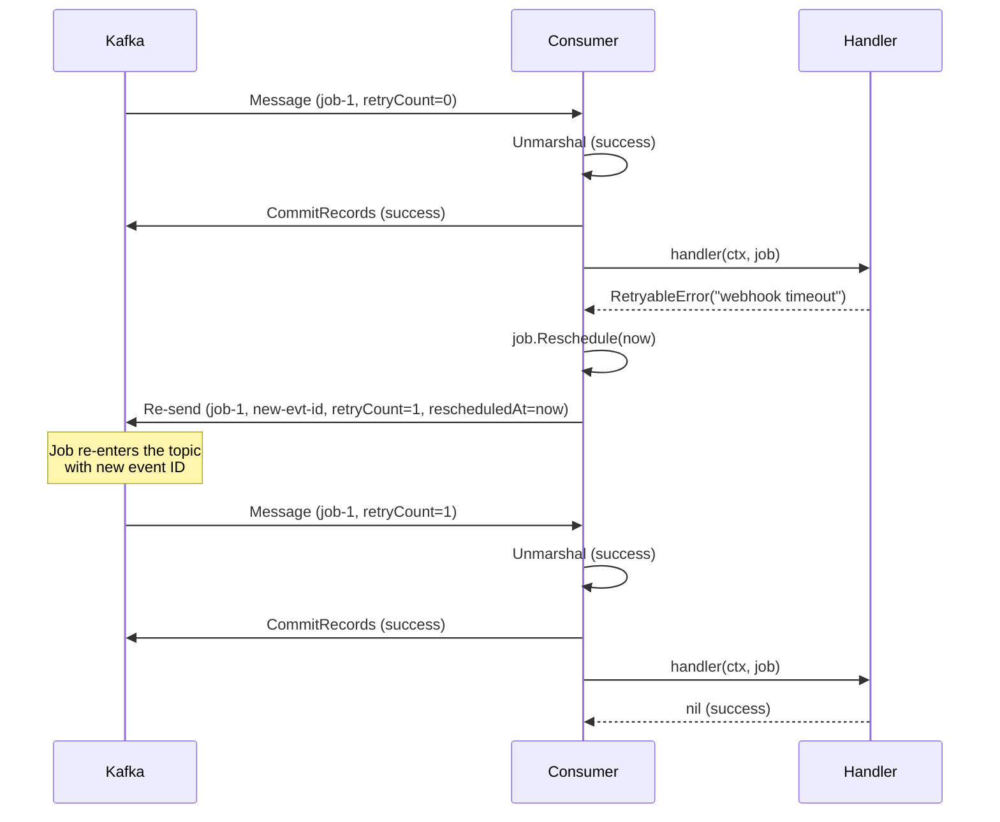

---

## Graceful shutdown

When the service receives a shutdown signal (SIGINT/SIGTERM):

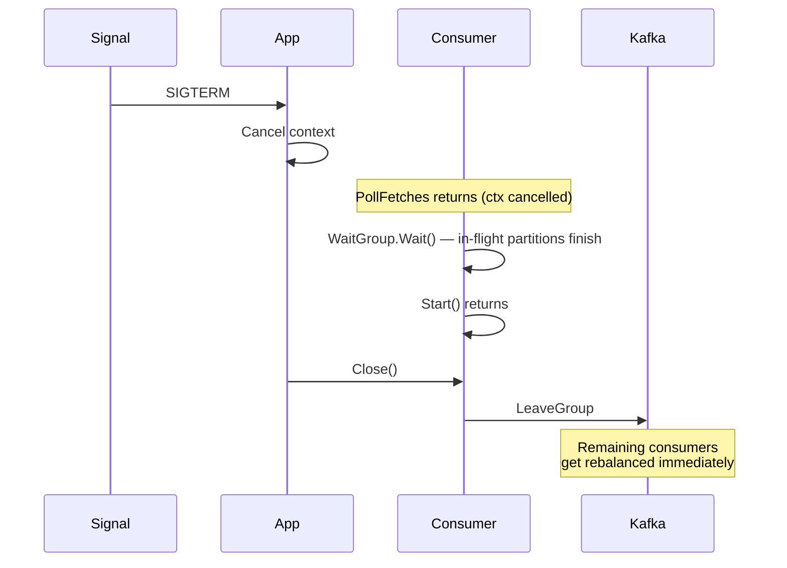

The key guarantee: **in-flight jobs are not interrupted.** The WaitGroup ensures all partition goroutines finish their current record before shutdown proceeds.

---

## Metrics

All metrics are defined in the `otel` package and recorded via function calls (no metric instruments leak into other packages).

### Kafka metrics

| Metric | Type | Description |
|---|---|---|
| `keepie.jobs.scheduled` | Counter | Jobs sent to Kafka |
| `keepie.jobs.consumed` | Counter | Jobs received from Kafka |
| `keepie.jobs.processed` | Counter | Jobs processed successfully |
| `keepie.jobs.failed` | Counter | Jobs failed with non-retryable error |
| `keepie.jobs.rescheduled` | Counter | Jobs rescheduled after retryable error |
| `keepie.jobs.unmarshal_errors` | Counter | Messages that failed to unmarshal |
| `keepie.consumer.offset_commit_errors` | Counter | Offset commits that failed |
| `keepie.jobs.processing_duration_seconds` | Histogram | Time spent in the handler |
| `keepie.jobs.time_in_queue_seconds` | Histogram | Time between creation/rescheduling and consumption |

### HTTP metrics

| Metric | Type | Description |
|---|---|---|
| `keepie.http.requests` | Counter | Number of HTTP handler executions |
| `keepie.http.invalid_bodies` | Counter | Requests with invalid or unparseable bodies |
| `keepie.http.duration_seconds` | Histogram | Duration of HTTP handler execution |

---

## HTTP API

The `api` package exposes an HTTP handler for scheduling jobs. The handler depends on a `JobScheduler` interface (implemented by `kafka.Producer`).

### `POST /jobs`

**Request:**
```json
{"webhook_url": "https://example.com/callback"}
```

**Response (202 Accepted):**
```json
{"job_id": "550e8400-e29b-41d4-a716-446655440000"}
```

**Errors:**
- `400 Bad Request` — invalid JSON, empty webhook URL, or invalid URL
- `500 Internal Server Error` — scheduler failed to send the job

---

## Integration tests

All tests use [testcontainers-go](https://github.com/testcontainers/testcontainers-go) to spin up a real Kafka instance in Docker. No manual setup needed.

Run with:
```bash
go test -tags=integration -v -timeout 300s ./kafka/...
```

### Test 1: Produce and Consume

**What it tests:** Basic end-to-end message flow — a produced message arrives at the consumer with all fields intact.

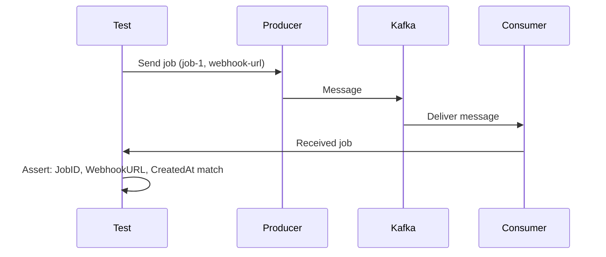

### Test 2: Workload Distribution

**What it tests:** 200 messages are distributed across 2 consumers in the same group. Each message is processed by exactly one consumer — no duplicates, no missed messages.

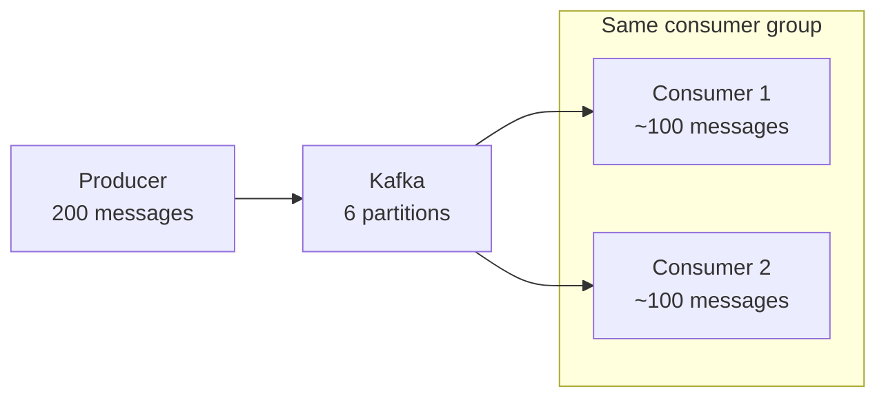

**Assertions:**
- Total messages received = 200
- Both consumers received at least 1 message
- No duplicate job IDs across consumers

### Test 3: Consumer Rebalancing

**What it tests:** When a consumer leaves the group, its partitions are reassigned to the remaining consumer.

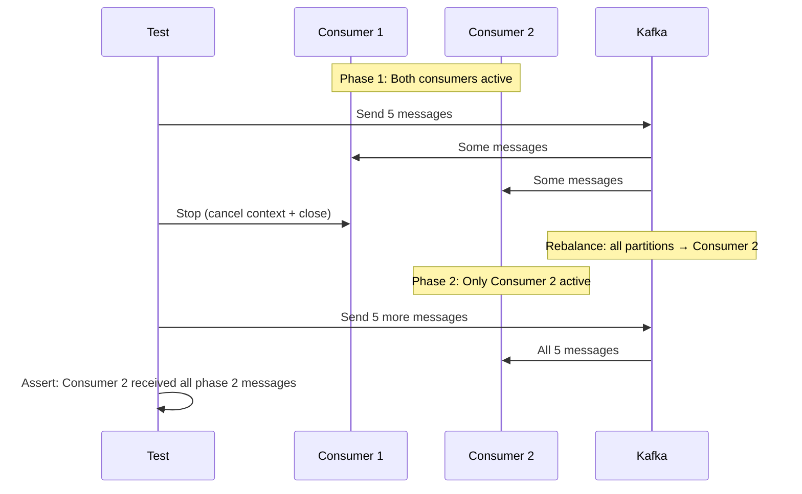

### Test 4: Offset Persistence

**What it tests:** After a consumer commits offsets and restarts, a new consumer in the same group resumes from where the previous one left off — it does not re-receive already committed messages.

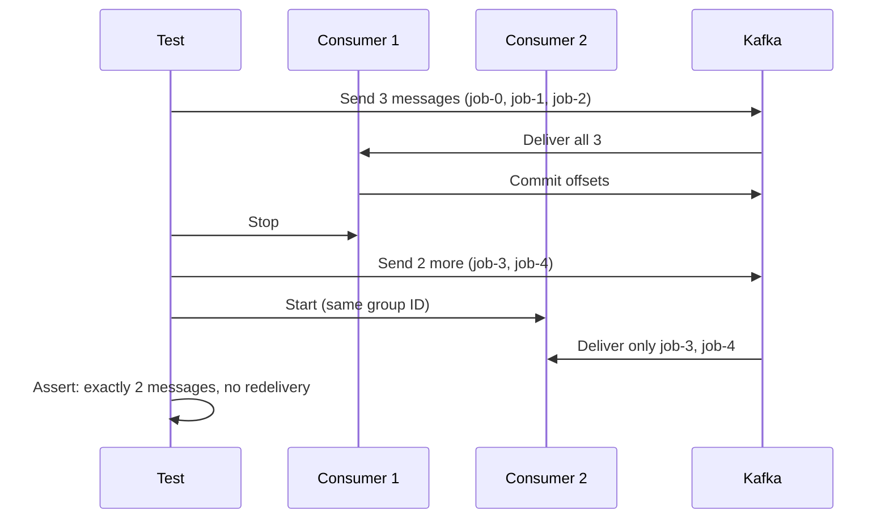

### Test 5: Retryable Error

**What it tests:** When a handler returns a retryable error, the job is rescheduled with incremented retry count. The second attempt succeeds.

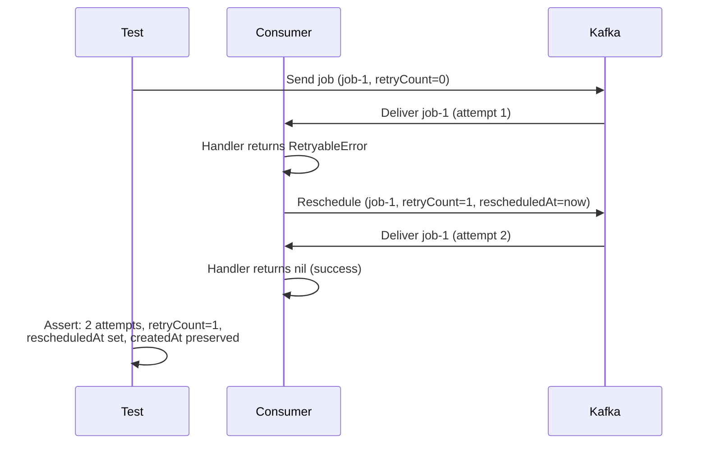
