# Kafka Client

## Configuration

| Setting | Value | Why |
|---|---|---|
| Partitions | 6 | Target: 2 instances x 2 workers = 4, with headroom for scaling |
| Offset commit | Manual, commit-first | Commit before processing to prevent duplicate JWTs |
| Partitioning | Round-robin (no key) | Jobs are independent, we want even distribution |
| Auto-offset-reset | `earliest` | On first start or expired offsets, process from beginning rather than skip |

---

## How the client works

### Producer

The producer sends job messages to the Kafka topic. Messages are JSON-encoded and distributed across partitions using round-robin (no message key).

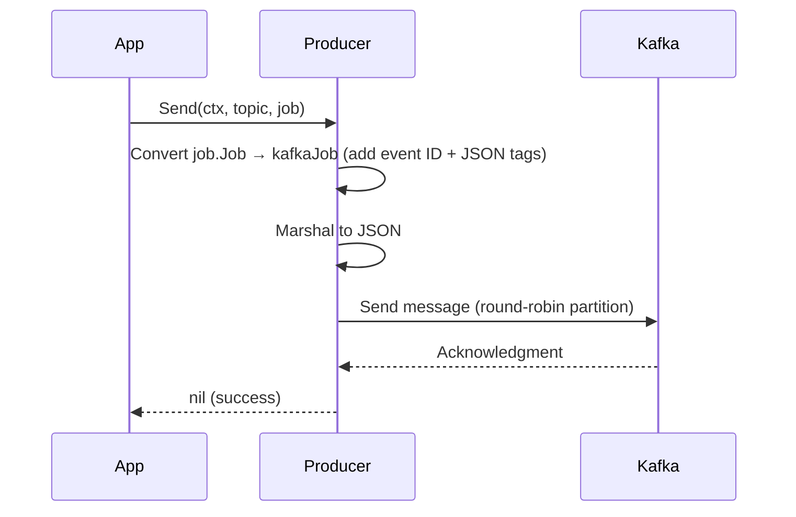

### Consumer

The consumer joins a consumer group. Kafka assigns partitions to it. For each assigned partition, a separate goroutine runs `ConsumeClaim`, processing messages sequentially within that partition.

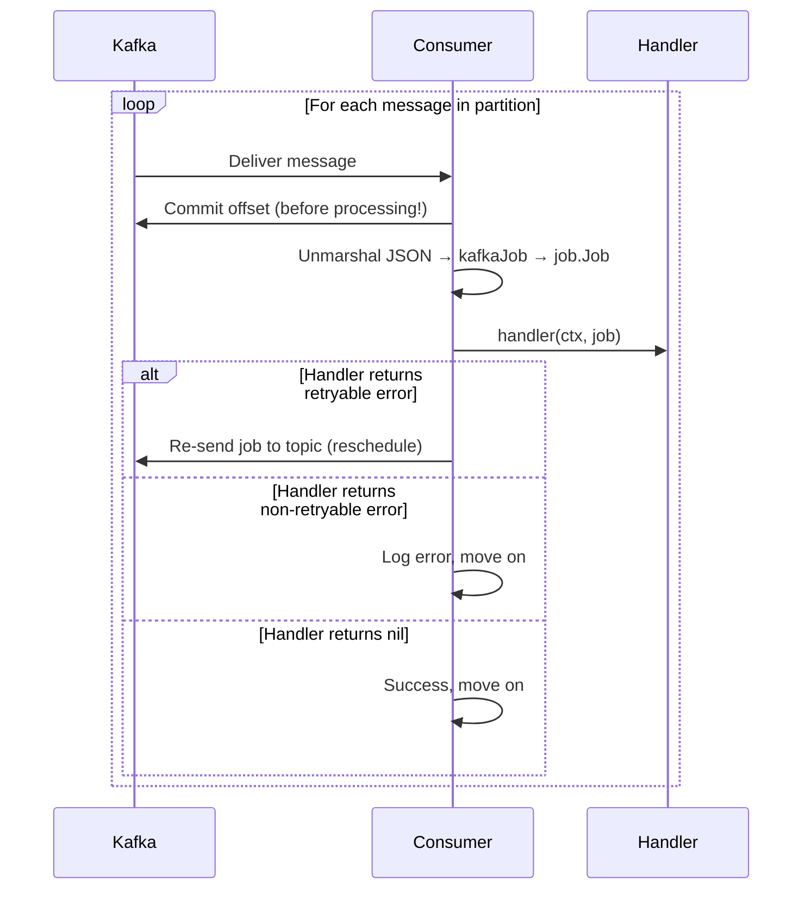

### Parallelism

Kafka internally runs one goroutine per assigned partition. You do not configure this — it is driven by how many partitions Kafka assigns to your consumer during rebalancing.

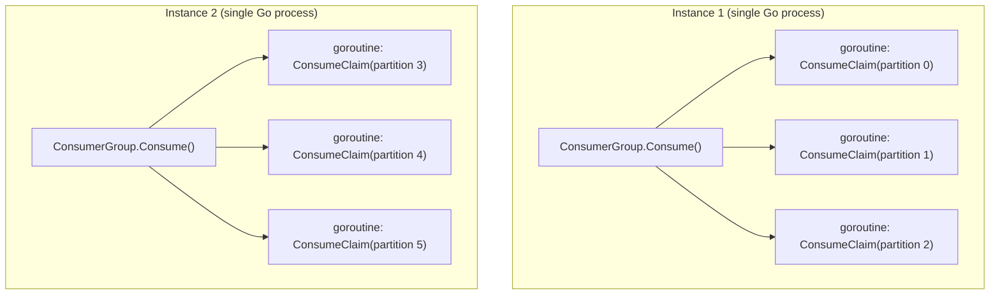

### Scaling behavior

1. **Instance 1 starts** — gets all 6 partitions, runs 6 goroutines
2. **Instance 2 starts** — triggers rebalance, each instance gets 3 partitions
3. **Instance 2 dies** — triggers rebalance, instance 1 gets all 6 back

Maximum useful consumers = number of partitions. Extra consumers sit idle as hot standbys.

---

## Commit-first strategy and failure points

We commit the offset **before** processing the job. This is a deliberate design choice driven by the fact that our job (generating a JWT and sending it to a webhook) is **not idempotent** — sending two different JWTs for the same request is worse than losing a single job.

### Message processing flow

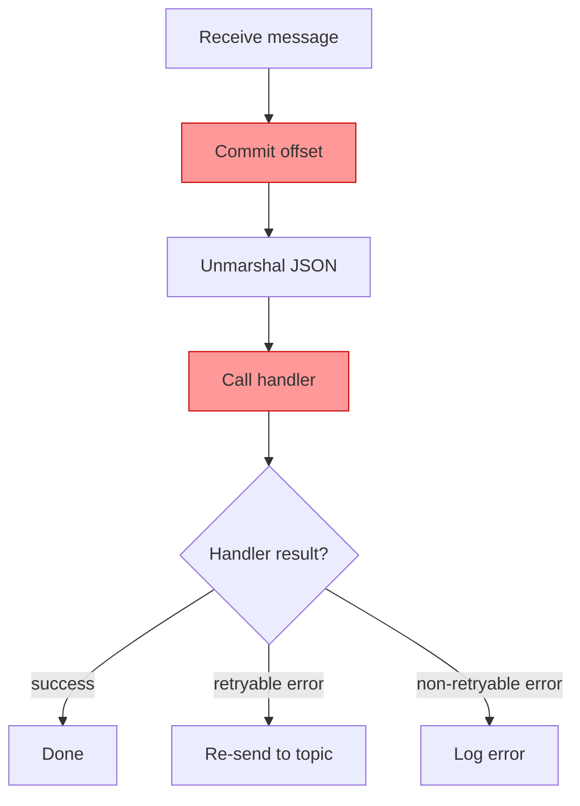

### Where jobs can be lost

> **The red-highlighted steps above are the danger zones.** A crash at these points means a committed offset with no processing.

| Failure point | What happens | Job lost? |
|---|---|---|
| Before offset commit | Offset not committed. On restart, message is redelivered. | No |
| **After commit, before handler starts** | **Offset committed, handler never ran.** | **YES** |
| **During handler execution (before webhook)** | **Offset committed, JWT never sent.** | **YES** |
| After webhook sent, before response received | Ambiguous — webhook may or may not have received the JWT. This is unavoidable in any distributed system. | Maybe |
| After successful handler return | Everything succeeded. | No |

**Why this is acceptable:** A lost job can be recovered — the client can retry their request. But a duplicate JWT (two different tokens for the same request) creates real confusion that cannot be automatically resolved.

### Retryable errors

When a handler returns an error wrapped with `job.MakeRetryable()`, the consumer creates a rescheduled copy of the job and sends it back to the topic. The rescheduled job has:

- A **new event ID** (UUID, generated by the Kafka layer) — so each attempt is uniquely identifiable in Kafka
- The **same job ID** — ties all attempts to the original logical job
- The **same createdAt** — preserves the original creation time
- A **rescheduledAt** timestamp — when this retry was scheduled
- An incremented **retryCount**

Note: the event ID is a Kafka transport concern, not part of the domain `job.Job` type. It is generated in the `kafkaJob` mapping layer when a job is sent to the topic.

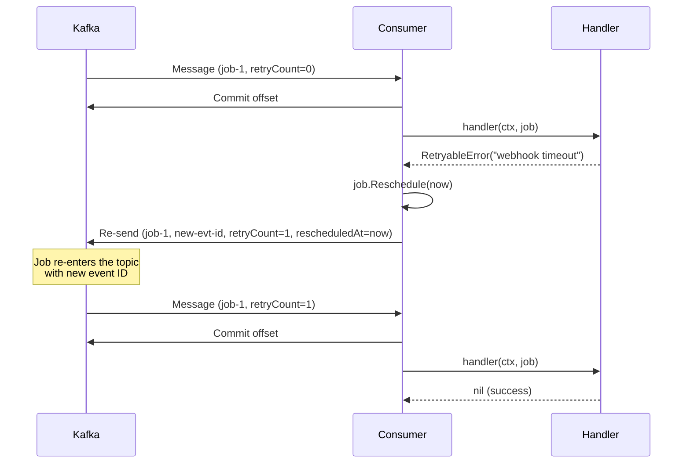

---

## Graceful shutdown

When the service receives a shutdown signal (SIGINT/SIGTERM):

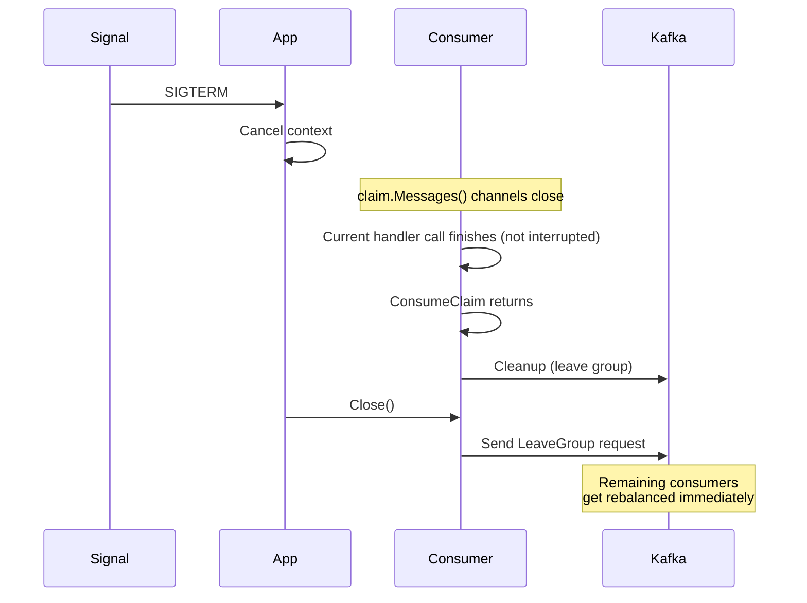

The key guarantee: **in-flight jobs are not interrupted.** Because the handler runs synchronously within `ConsumeClaim`, the current job will finish before the consumer shuts down.

---

## Integration tests

All tests use [testcontainers-go](https://github.com/testcontainers/testcontainers-go) to spin up a real Kafka instance in Docker. No manual setup needed.

Run with:
```bash
go test -tags=integration -v -timeout 300s ./kafka/...
```

### Test 1: Produce and Consume

**What it tests:** Basic end-to-end message flow — a produced message arrives at the consumer with all fields intact.

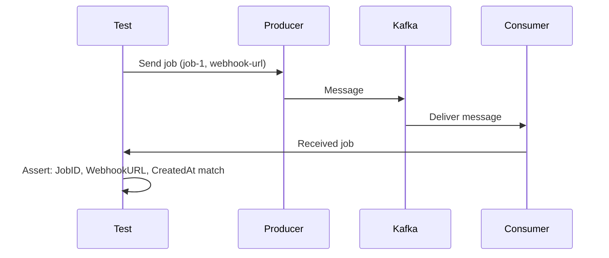

### Test 2: Workload Distribution

**What it tests:** 200 messages are distributed across 2 consumers in the same group. Each message is processed by exactly one consumer — no duplicates, no missed messages.

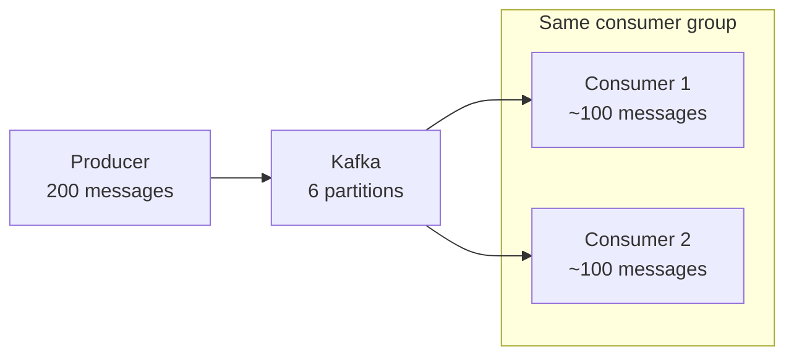

**Assertions:**
- Total messages received = 200
- Both consumers received at least 1 message
- No duplicate job IDs across consumers

### Test 3: Consumer Rebalancing

**What it tests:** When a consumer leaves the group, its partitions are reassigned to the remaining consumer.

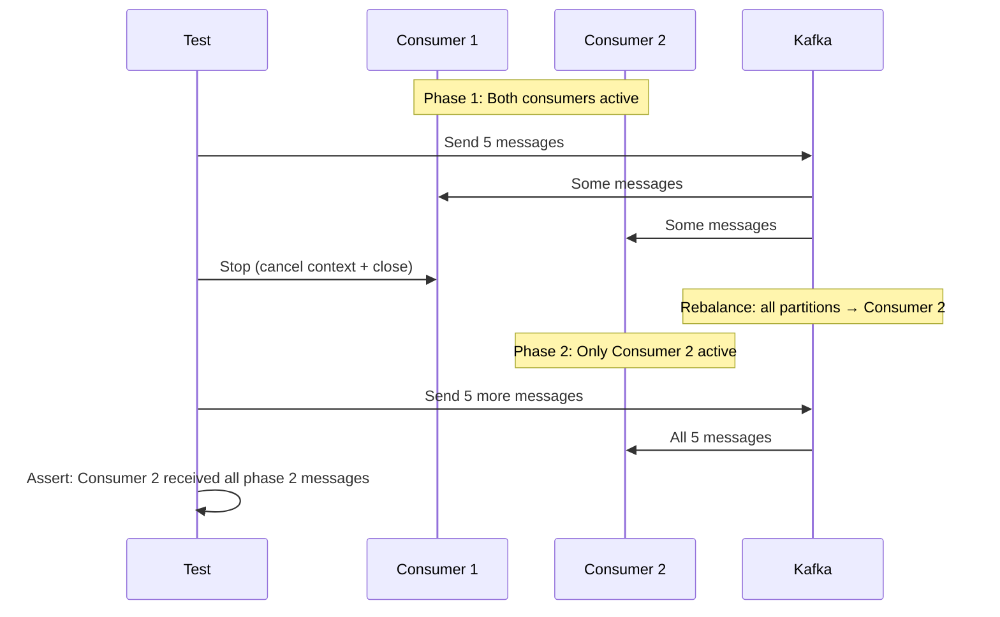

### Test 4: Offset Persistence

**What it tests:** After a consumer commits offsets and restarts, a new consumer in the same group resumes from where the previous one left off — it does not re-receive already committed messages.

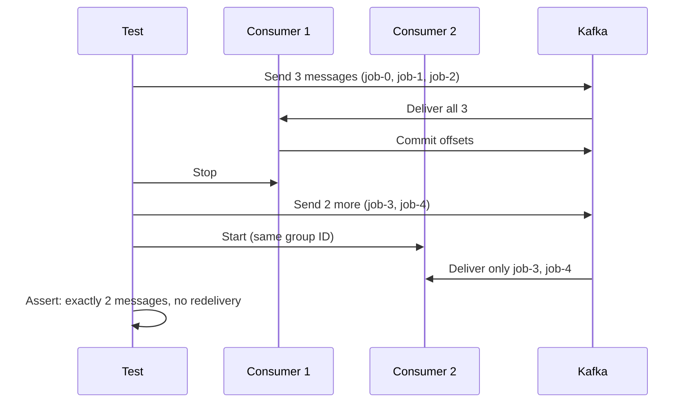

### Test 5: Retryable Error

**What it tests:** When a handler returns a retryable error, the job is rescheduled with a new event ID and incremented retry count. The second attempt succeeds.

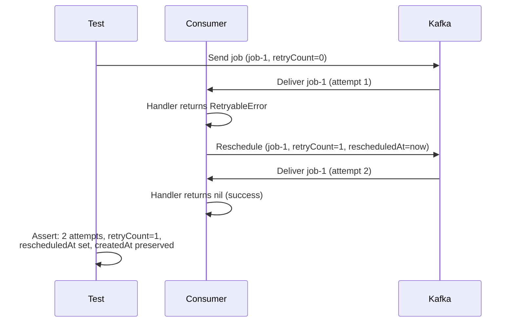
