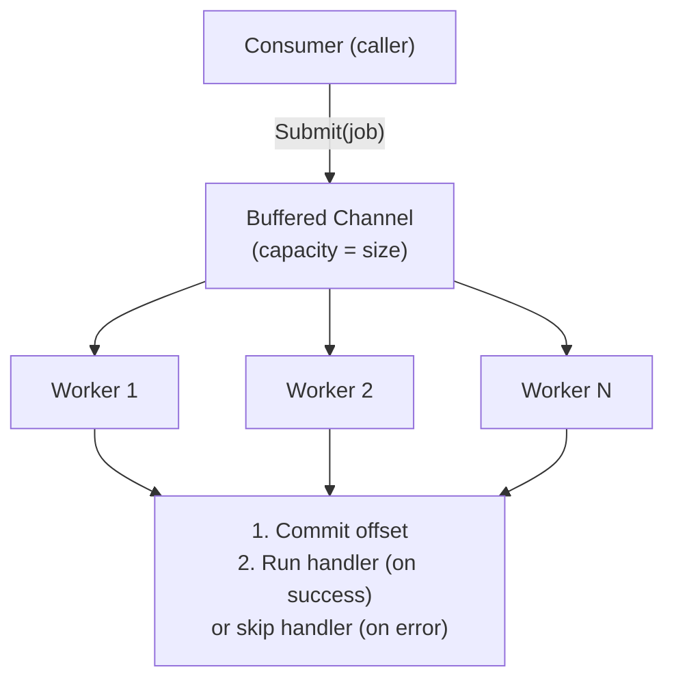
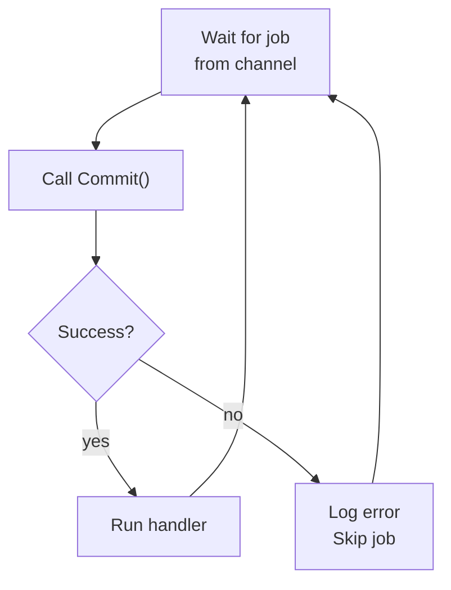
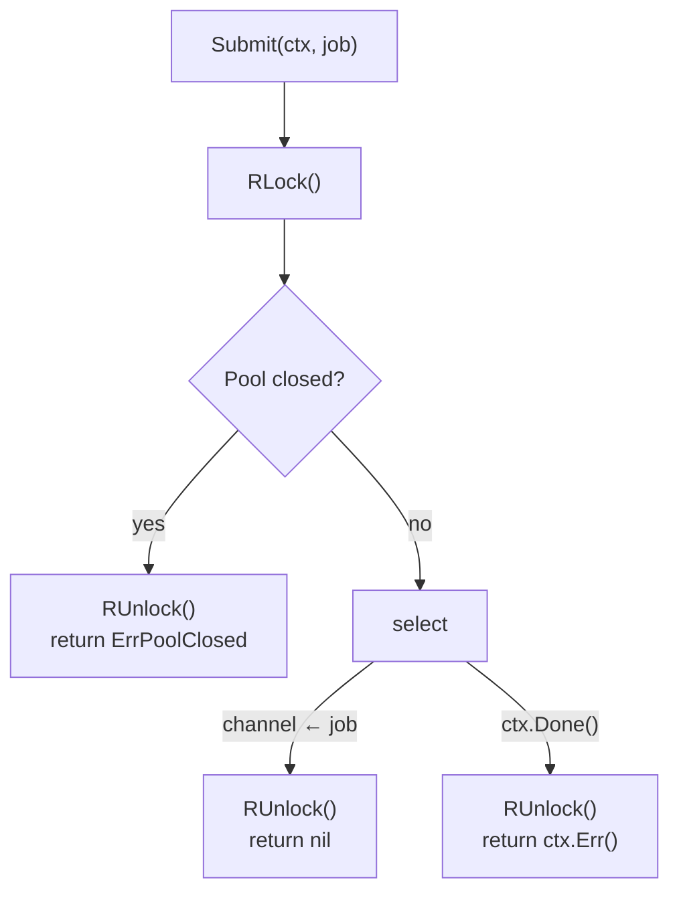
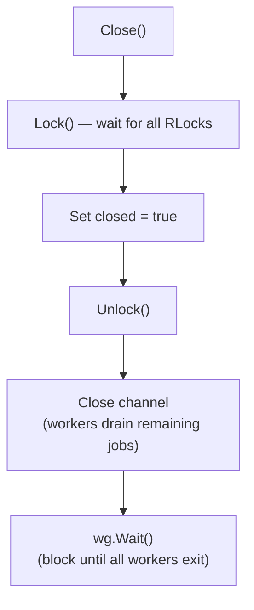

# pool

A fixed-size worker pool for concurrent job processing with pre-execution offset commits.

## Overview

The pool decouples job consumption from job processing. A caller (typically a Kafka consumer) submits jobs to the pool via a buffered channel. Each worker picks a job, commits its offset, and then runs the handler. This ensures at-least-once delivery semantics — the offset is committed before processing begins, so a crash during processing won't cause the message to be redelivered.

## Architecture



## Worker flow

Each worker goroutine runs the same loop:



## Submit and backpressure

`Submit` holds an `RLock` for the entire check-and-send, preventing a
concurrent `Close` from closing the channel mid-send. When the channel is
full (all workers busy and buffer saturated), `Submit` blocks until either a
slot opens or the context is cancelled:



The buffered channel has capacity equal to the number of workers, so up to `2 * size` jobs can be outstanding at once (size in workers + size in buffer).

## Graceful shutdown

`Close` acquires a write lock (waiting for all in-flight `Submit` calls to
finish their send), then closes the channel so workers drain remaining jobs:



**Shutdown order matters:** close the pool before the Kafka consumer so that
in-flight commit functions (which use `context.Background()`) can reach the
broker while the connection is still alive.

## Caveat: per-partition commit ordering

With multiple workers, two workers can commit records from the same Kafka
partition out of order. Kafka's `OffsetCommit` is last-write-wins per
partition, so a slower worker committing offset 51 after a faster worker
committed offset 104 regresses the committed position to 51. On restart,
offsets 51–104 get re-delivered.

This is acceptable when the handler is idempotent or when re-delivery is
tolerable. For strict exactly-once semantics, use pool size 1 or implement
batched per-partition offset tracking.

## Usage

```go
p := pool.New(10, func(ctx context.Context, j job.Job) {
    // process job
})

err := p.Submit(ctx, pool.Job{
    Payload: j,
    Commit:  func() error { /* commit offset */ return nil },
})

// on shutdown
p.Close() // blocks until all workers finish
```
